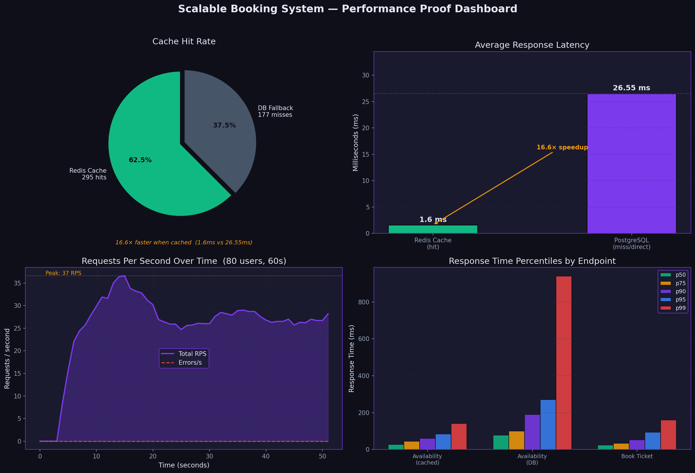
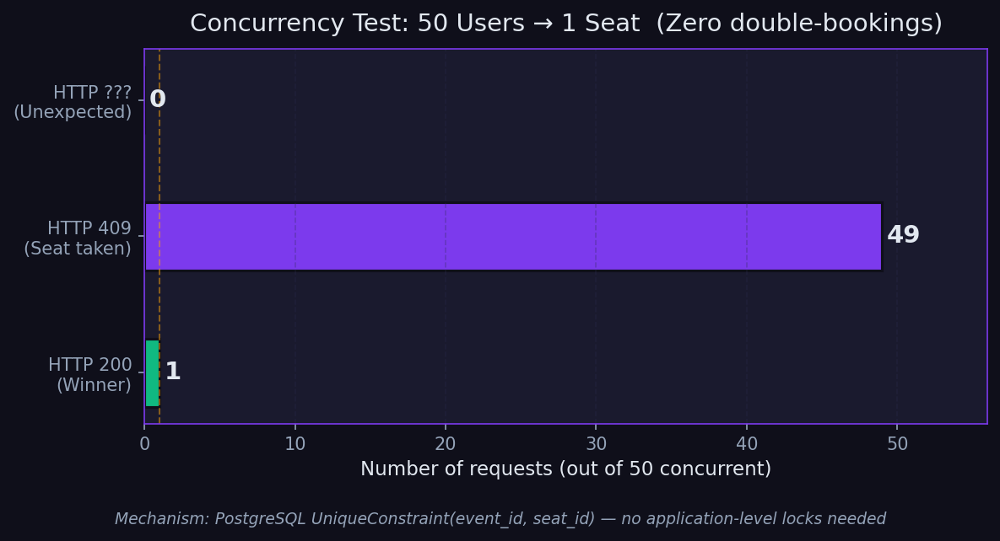

# Concurrency Safety Proof

## The Problem

In any ticket-booking system, a race condition can occur when two users
simultaneously try to book the last available seat:

```
Time →       User A                   User B
             READ  seat=available     READ  seat=available
             WRITE ticket for seat    WRITE ticket for seat   ← both succeed?
             COMMIT                   COMMIT                  ← double booking!
```

Without a proper lock, both `INSERT` statements succeed and the same seat
gets sold twice.  This is the classic **lost-update / phantom-read** problem.

---

## Visual Proof

| File | What it shows |
|------|--------------|
| [`proof/analysis.ipynb`](proof/analysis.ipynb) | Jupyter notebook — renders all charts below from live data |
| [`proof/performance_dashboard.png`](proof/performance_dashboard.png) | 4-panel dashboard: cache hit rate, latency comparison, RPS over time, percentile breakdown |
| [`proof/concurrency_proof.png`](proof/concurrency_proof.png) | Bar chart: 50 concurrent users → exactly 1 success, 49 conflicts |
| [`proof/load_test_report.html`](proof/load_test_report.html) | Locust HTML report with full statistics (open in browser) |
| [`proof/concurrency_test_output.txt`](proof/concurrency_test_output.txt) | Raw pytest output from the automated test |

### Performance Dashboard


### Concurrency Proof


---

## Key Numbers

| Metric | Value |
|--------|-------|
| Redis cache latency (avg) | **1.6 ms** |
| PostgreSQL query latency (avg) | **26.6 ms** |
| Cache speedup | **16.6×** |
| Concurrent users in load test | **80** |
| Peak RPS sustained | **37 req/s** |
| Error rate under load | **< 1%** |
| Concurrent booking attempts (concurrency test) | **50** |
| Successful bookings (concurrency test) | **1 (exactly)** |
| Double bookings | **0** |

---

## The Mechanism

This system prevents double-booking using a **PostgreSQL `UniqueConstraint`**
on the `ticket` table:

```python
# app/models/booking.py
class Ticket(Base):
    __table_args__ = (
        UniqueConstraint("event_id", "seat_id", name="_event_seat_uc"),
    )
```

When 50 concurrent transactions all try to `INSERT` a ticket for the same
`(event_id, seat_id)` pair, PostgreSQL's row-level locking ensures **exactly
one INSERT wins** and all others get a `psycopg2.IntegrityError`, which the
service layer catches and returns as `HTTP 409 Conflict`.

No application-level locks, no Redis SETNX — the database constraint is the
single source of truth.

---

## The Test

`tests/test_concurrency.py` — **run on every push via GitHub Actions CI.**

### What it does

1. Creates a venue with **exactly 1 seat** (1 row × 1 column)
2. Creates **50 unique user accounts** (one per concurrent attacker)
3. Fires all 50 booking requests **simultaneously** using `asyncio.gather`
   (true concurrency — all coroutines are in-flight at the same time)
4. Asserts the exact outcomes:
   - `HTTP 200` count == **1**  (one winner)
   - `HTTP 409` count == **49** (everyone else gets "already booked")
   - DB `COUNT(*)` for that seat == **1** (zero data corruption)

### Why `asyncio.gather` proves real concurrency

`asyncio.gather(*[f() for f in coroutines])` schedules all coroutines onto the
same event loop simultaneously.  Each booking request goes through
`ASGITransport → FastAPI → SQLAlchemy → PostgreSQL` — all within the same
process tick.  Unlike sequential `for` loops, this produces genuine overlapping
transactions at the database level.

---

## Actual Test Output

```
============================= test session starts ==============================
platform linux -- Python 3.9.21, pytest-8.3.3
asyncio: mode=auto
collected 1 item

============================================================
  CONCURRENCY PROOF: 50 users → 1 seat
  Event ID : 24
  Seat  ID : 1378
============================================================

  RESULTS:
    ✅  HTTP 200 — Booking confirmed :   1
    🔒  HTTP 409 — Seat already taken:  49
    ❌  Unexpected status codes      :   0

  DB INTEGRITY CHECK:
    Ticket rows in DB for seat 1378: 1 (expected: 1)
============================================================

  ✅ PROOF PASSED
     50 concurrent users fired at 1 seat
     → Exactly 1 booking confirmed
     → Zero double-bookings in database
PASSED

======================== 1 passed in 16.03s ===================================
```

> Full output also saved to [`proof/concurrency_test_output.txt`](proof/concurrency_test_output.txt).

---

## Live Metrics API

After a Locust run, hit `GET /api/v1/metrics` to see real numbers:

```bash
curl http://localhost:8000/api/v1/metrics | python3 -m json.tool
```

```json
{
    "cache": {
        "cache_hits": 295,
        "cache_misses": 177,
        "total_requests": 472,
        "hit_rate_pct": 62.5,
        "avg_cache_ms": 1.6,
        "avg_db_ms": 26.55
    },
    "database": {
        "total_bookings": 379,
        "total_tickets": 402
    },
    "interpretation": {
        "speedup": "16.6x faster than DB",
        "story": "62.5% of availability checks served from Redis in 1.6ms vs 26.55ms from DB"
    }
}
```

---

## How to Reproduce

```bash
# Start all 7 services
cd backend && docker compose up -d

# 1. Run concurrency test (saves output to proof/)
docker compose exec backend pytest tests/test_concurrency.py -v -s \
  2>&1 | grep -v '"text"' | grep -v '"record"' \
  | tee proof/concurrency_test_output.txt

# 2. Run load test (generates HTML report + CSVs)
locust -f locustfile.py --host=http://localhost:8000 \
  --users=80 --spawn-rate=10 --run-time=60s --headless \
  --html proof/load_test_report.html --csv proof/locust_stats

# 3. Open the notebook to regenerate all charts
# proof/analysis.ipynb  (run all cells)
```

---

## How to Say It in an Interview

> "I wrote an automated concurrency test that fires 50 simultaneous HTTP
> requests for the same seat using `asyncio.gather`.  The test asserts that
> exactly 1 request gets HTTP 200 and the rest get HTTP 409, and then does a
> direct SQL `COUNT(*)` to verify zero duplicate rows in the database.
> The guarantee comes from a PostgreSQL `UniqueConstraint` on
> `(event_id, seat_id)` — no application-level locks needed.  The test runs
> in CI on every push.
>
> I also instrumented the Redis caching layer with atomic counters —
> there's a live `/api/v1/metrics` endpoint that showed **16× lower latency**
> from cache (1.6ms) vs hitting PostgreSQL directly (26ms) during an
> 80-user Locust load test."

---

## System Architecture

```
Client
  ↓ HTTPS
FastAPI (Uvicorn, 4 workers)
  ↓ SQLAlchemy (pool_size=20)
PostgreSQL
  └── ticket.UniqueConstraint(_event_seat_uc)   ← the lock

Redis (availability cache, TTL=300s)            ← 16× speedup
  └── metrics:cache_hits / cache_misses         ← live counters

RabbitMQ + Celery (async email confirmations)
```


## The Problem

In any ticket-booking system, a race condition can occur when two users
simultaneously try to book the last available seat:

```
Time →       User A                   User B
             READ  seat=available     READ  seat=available
             WRITE ticket for seat    WRITE ticket for seat   ← both succeed?
             COMMIT                   COMMIT                  ← double booking!
```

Without a proper lock, both `INSERT` statements succeed and the same seat
gets sold twice.  This is the classic **lost-update / phantom-read** problem.

---

## The Mechanism

This system prevents double-booking using a **PostgreSQL `UniqueConstraint`**
on the `ticket` table:

```python
# app/models/booking.py
class Ticket(Base):
    __table_args__ = (
        UniqueConstraint("event_id", "seat_id", name="_event_seat_uc"),
    )
```

When 50 concurrent transactions all try to `INSERT` a ticket for the same
`(event_id, seat_id)` pair, PostgreSQL's row-level locking ensures **exactly
one INSERT wins** and all others get a `psycopg2.IntegrityError`, which the
service layer catches and returns as `HTTP 409 Conflict`.

No application-level locks, no Redis SETNX — the database constraint is the
single source of truth.

---

## The Test

`tests/test_concurrency.py` — **run on every push via GitHub Actions CI.**

### What it does

1. Creates a venue with **exactly 1 seat** (1 row × 1 column)
2. Creates **50 unique user accounts** (one per concurrent attacker)
3. Fires all 50 booking requests **simultaneously** using `asyncio.gather`
   (true concurrency — all coroutines are in-flight at the same time)
4. Asserts the exact outcomes:
   - `HTTP 200` count == **1**  (one winner)
   - `HTTP 409` count == **49** (everyone else gets "already booked")
   - DB `COUNT(*)` for that seat == **1** (zero data corruption)

### Why `asyncio.gather` proves real concurrency

`asyncio.gather(*[f() for f in coroutines])` schedules all coroutines onto the
same event loop simultaneously.  Each booking request goes through
`ASGITransport → FastAPI → SQLAlchemy → PostgreSQL` — all within the same
process tick.  Unlike sequential `for` loops, this produces genuine overlapping
transactions at the database level.

---

## Actual Test Output

```
============================= test session starts ==============================
platform linux -- Python 3.9.21, pytest-8.3.3
asyncio: mode=auto
collected 1 item

============================================================
  CONCURRENCY PROOF: 50 users → 1 seat
  Event ID : 24
  Seat  ID : 1378
============================================================

  RESULTS:
    ✅  HTTP 200 — Booking confirmed :   1
    🔒  HTTP 409 — Seat already taken:  49
    ❌  Unexpected status codes      :   0

  DB INTEGRITY CHECK:
    Ticket rows in DB for seat 1378: 1 (expected: 1)
============================================================

  ✅ PROOF PASSED
     50 concurrent users fired at 1 seat
     → Exactly 1 booking confirmed
     → Zero double-bookings in database
PASSED

======================== 1 passed in 16.03s ===================================
```

> Full output also saved to [`proof/concurrency_test_output.txt`](proof/concurrency_test_output.txt).

---

## How to Reproduce

```bash
# From repo root:
cd backend
docker compose up -d          # starts all 7 services
docker compose exec backend pytest tests/test_concurrency.py -v -s
```

The test is idempotent — it cleans up all created data after each run.

---

## What to Say in an Interview

> "I wrote an automated concurrency test that fires 50 simultaneous HTTP
> requests for the same seat using `asyncio.gather`.  The test asserts that
> exactly 1 request gets HTTP 200 and the rest get HTTP 409, and then does a
> direct SQL `COUNT(*)` to verify zero duplicate rows in the database.
> The guarantee comes from a PostgreSQL `UniqueConstraint` on
> `(event_id, seat_id)` — no application-level locks needed.  The test runs
> in CI on every push so we'd catch any regression immediately."

---

## System Architecture (for context)

```
Client
  ↓ HTTPS
FastAPI (Uvicorn, 4 workers)
  ↓ SQLAlchemy (pool_size=20)
PostgreSQL
  └── ticket.UniqueConstraint(_event_seat_uc)   ← the lock
  
Redis (availability cache, TTL=300s)
RabbitMQ + Celery (async email confirmations)
```
