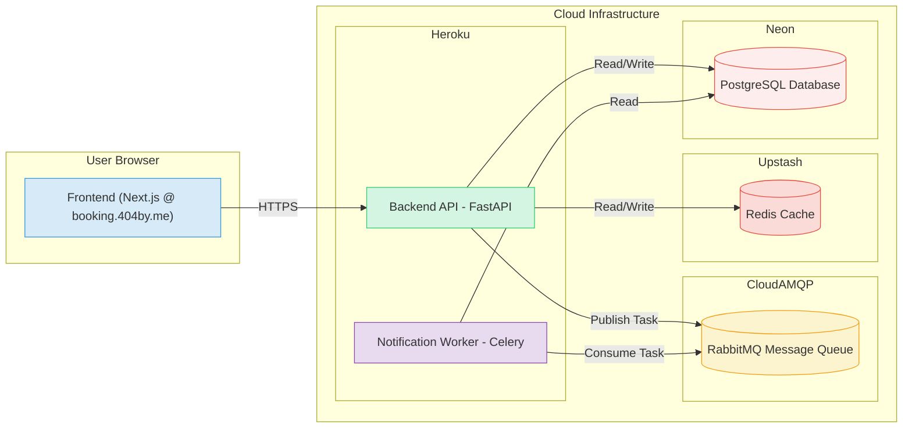

# Scalable Booking System

[](https://booking.404by.me/)

A production-grade, distributed backend system for a ticket booking platform, engineered with a focus on concurrency safety, high performance, observability, and automated cloud deployment. Includes a minimal Next.js frontend for core user flows.


## Overview

This project simulates a real-world, scalable platform where users can discover events (like movies or concerts), view real-time seat availability, and securely book or cancel tickets. The system is designed with a backend-first approach, emphasizing robust architecture, data integrity under concurrent load, and operational readiness.

The core challenge was to build a booking process that prevents double-bookings (race conditions) even when many users attempt to book the same seat simultaneously, while maintaining a responsive user experience and a decoupled architecture suitable for future expansion.

## Key Features

* **Concurrency-Safe Bookings:** Utilizes atomic database transactions and unique constraints in PostgreSQL to guarantee that seats cannot be double-booked, even under heavy concurrent load.
* **Real-Time Availability:** Leverages Redis caching with write-through invalidation to provide low-latency seat availability checks, protecting the database from high read volumes.
* **User & Organizer Roles:** Supports distinct user roles (`customer`, `organizer`) with role-based access control implemented via JWT authentication.
* **Asynchronous Notifications:** Offloads tasks like sending booking confirmations to a separate Celery worker via a RabbitMQ message queue, ensuring fast API responses.
* **Persistent State:** All bookings, events, venues, and user data are durably stored in a PostgreSQL database (Neon).
* **Observability:** Implements structured JSON logging (Loguru) and exposes application performance metrics for Prometheus/Datadog.
* **Automated Deployment:** Features a CI/CD pipeline using GitHub Actions to automatically test and deploy the containerized backend services to Heroku.
* **Minimal Frontend:** A responsive Next.js/Tailwind CSS interface for browsing events, viewing details, signing up/logging in, and booking tickets.

## Architecture

The application employs a distributed, multi-service architecture designed for scalability and resilience.




1.  **Frontend (Next.js on Vercel):** The user interface, responsible for displaying information and capturing user input. Communicates with the Backend API via HTTPS REST calls.
2.  **Backend API (FastAPI on Heroku):** The main service handling user requests, authentication, business logic for browsing and booking, interacting with the cache, and publishing tasks to the message queue.
3.  **Notification Worker (Celery on Heroku):** An asynchronous background service that consumes tasks (like "send booking confirmation") from the message queue and executes them independently of the API, often involving database reads.
4.  **Database (PostgreSQL on Neon):** The primary source of truth, storing user accounts, event details, venue layouts, and booking records. Enforces data integrity via constraints.
5.  **Cache (Redis on Upstash):** An in-memory key-value store used to cache frequently accessed data (like seat availability) for fast reads, reducing load on the PostgreSQL database.
6.  **Message Queue (RabbitMQ on CloudAMQP):** Acts as a buffer and communication channel between the Backend API and the Notification Worker, enabling asynchronous processing and decoupling.

## Technology Stack

**Backend:**
* **Framework:** FastAPI
* **Language:** Python 3.9+
* **Async Tasks:** Celery
* **Message Queue:** RabbitMQ (via CloudAMQP)
* **Database:** PostgreSQL
* **ORM:** SQLAlchemy
* **Migrations:** Alembic
* **Caching:** Redis (via Upstash)
* **Authentication:** JWT, Passlib (Argon2)
* **Testing:** `pytest`, Locust

**Frontend:**
* **Framework:** Next.js (App Router)
* **Language:** TypeScript
* **UI Library:** React
* **Styling:** Tailwind CSS

**Infrastructure:**
* **Containerization:** Docker, Docker Compose
* **Deployment (Backend):** Heroku (Container Stack)
* **Deployment (Frontend):** Vercel
* **Deployment (Database):** Neon (Serverless PostgreSQL)
* **CI/CD:** GitHub Actions
* **Monitoring:** Datadog (via Heroku Buildpack), Prometheus-compatible metrics endpoint

## Running Locally

1.  **Prerequisites:**
    * Docker & Docker Compose
    * Node.js & npm (for the frontend)
    * Python 3.9+ & pip (for the backend venv, optional if only using Docker)

2.  **Clone the Repository:**
    ```bash
    git clone https://github.com/unknown788/scalable-booking-system
    cd scalable-booking-app
    ```

3.  **Backend Setup:**
    * Navigate to the `backend` directory: `cd backend`
    * Create and populate the `.env` file from `.env.example` (or use the provided Docker Compose config).
    * (Optional venv setup): `python3 -m venv venv && source venv/bin/activate && pip install -r requirements.txt`
    * Navigate back to the root: `cd ..`

4.  **Start Services with Docker Compose:**
    From the **root** (`scalable-booking-app`) directory, run:
    ```bash
    docker-compose up -d --build
    ```
    This starts the Backend API, Notification Worker, PostgreSQL DB, Redis, RabbitMQ, and Mailpit (for email testing).

5.  **Run Backend Database Migrations:**
    Apply the database schema:
    ```bash
    docker-compose exec backend alembic upgrade head
    ```

6.  **Start the Frontend:**
    * Navigate to the `frontend` directory: `cd frontend`
    * Install dependencies: `npm install`
    * Create a `.env.local` file with `NEXT_PUBLIC_API_URL=http://localhost:8000`.
    * Start the development server: `npm run dev`

7.  **Access the Application:**
    * **Frontend:** `http://localhost:3000`
    * **Backend API Docs:** `http://localhost:8000/docs`
    * **RabbitMQ Console:** `http://localhost:15672` (guest/guest)
    * **Mailpit Inbox:** `http://localhost:8025`

## Deployment

* **Backend API & Worker:** Deployed as separate Docker processes on Heroku (using `heroku.yml`).
* **Frontend:** Deployed on Vercel.
* **Database:** Hosted on Neon (Serverless PostgreSQL).
* **Cache:** Hosted on Upstash (Serverless Redis).
* **Queue:** Hosted on CloudAMQP (Managed RabbitMQ).
* **CI/CD:** Automated testing and deployment via GitHub Actions.
* **Monitoring:** Logs and metrics forwarded to Datadog.
* **Domain:** The live application is hosted at `https://booking.404by.me/`.

## Key Debugging Journey & Learnings

This project involved overcoming significant real-world challenges:

1.  **Concurrency Control:** Implemented and load-tested atomic transactions to prevent booking race conditions, validating success via Locust tests showing `409 Conflict` errors under load (which is the correct behavior).
2.  **Performance Tuning:** Diagnosed and resolved database connection pool exhaustion under load by tuning SQLAlchemy's `pool_size`. Implemented Redis caching with correct invalidation logic. Decoupled slow notification tasks using Celery/RabbitMQ.
3.  **Deployment Complexity:** Debugged numerous environment-specific issues across Docker, Heroku, and cloud services, including CORS, `PYTHONPATH`, database hostnames, `rediss://` SSL flags, Heroku stack misconfiguration, conflicting library requirements, stale build caches (requiring purging and `PYTHONDONTWRITEBYTECODE`), and Git state corruption.
4.  **Observability Setup:** Integrated structured logging and Prometheus metrics, configuring Datadog integration via buildpacks for production monitoring.

This iterative debugging and refinement process was essential for building a truly robust, scalable, and production-ready system.
